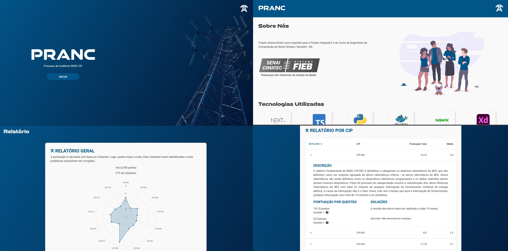

# 📋 PRANC
PRANC is a demo version of a software that simulates the NERC CIP CyberSecurity Framework audit process. [Access Now](https://pranc.vercel.app/)
 
<h1 align="center">
    
</h1>

## 🎯 Purpose
Project developed to meet the demands of the 3rd integrating project of Computer Engineering of Senai Cimatec, which was implement an audit process of a CyberSecurity Framework on a application.


## :rocket: Technologies
- [NextJs](https://nextjs.org)
- [TypeScript](https://www.typescriptlang.org/)


## Getting Started

Download the project dependencies.

```bash
npm install
# or
yarn
```

Then, run the development server:

```bash
npm run dev
# or
yarn dev
```

Open [http://localhost:3000](http://localhost:3000) with your browser to see the result.
